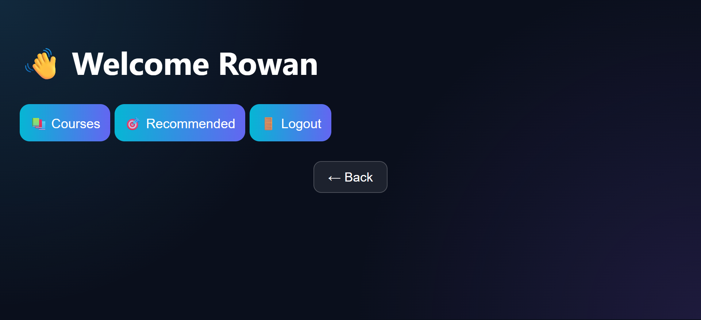

# 🎓 Online Learning & Course Recommendation Platform

A full-stack EdTech MERN-style project that allows users to register, login, explore courses, get personalized recommendations, enroll in courses, and track learning progress.

---

## 🚀 Features

- #UserAuthentication (Register/Login with JWT)
- #CourseListing
- #CourseRecommendationSystem
- #EnrollmentSystem
- #UserDashboard
- #ProgressTracking
- #RESTAPIIntegration
- #MongoDBDatabase
- #ResponsiveFrontendUI
- #FullStackProject

---

## 🛠️ Tech Stack

- #Frontend → HTML, CSS, JavaScript (Vanilla JS)
- #Backend → Node.js, Express.js
- #Database → MongoDB (Local)
- #Authentication → JWT
- #API → REST APIs
- #Tools → VS Code, Git, GitHub, Live Server

---

## 📁 Project Structure

client/
  ├── index.html
  ├── app.js
  ├── styles.css
  ├── core/
  │   └── api.js
  ├── auth/
  ├── pages/
  └── components/

server/
  ├── server.js
  ├── config/
  │   └── db.js
  ├── models/
  │   ├── User.js
  │   ├── Course.js
  │   └── Enrollment.js
  ├── routes/
  ├── controllers/
  ├── middleware/
  └── utils/

---

## ⚙️ Installation & Setup

### 1️⃣ Clone Repository

git clone https://github.com/your-username/edtech-platform.git
cd edtech-platform

---

### 2️⃣ Setup Backend

cd server
npm install

Create .env file:

PORT=5000
MONGO_URI=mongodb://127.0.0.1:27017/edtech_platform
JWT_SECRET=your_secret_key

Run backend:

node server.js

---

### 3️⃣ Setup Frontend

Open:
client/index.html

Run using Live Server (VS Code Extension)

---

## 🔄 Application Flow

Register → Login → Dashboard → Browse Courses → Enroll → Recommendations → Progress Tracking

---

## 📸 Screenshots Checklist

### Dashboard

### Courses

---
## 🚀 Future Enhancements

#ReactJSUpgrade  
#AIRecommendationEngine  
#CloudDeployment  
#PaymentIntegration  
#AdminDashboard  
#ProgressTracking  
#CertificateGeneration  

---

## ⭐ Project Highlights

✔ Authentication system  
✔ Course recommendation engine  
✔ Clean modular structure  
✔ Beginner-friendly full stack project  
✔ GitHub-ready format  
✔ Interview-ready explanation

---

## 👨‍💻 Author

Built by Nidhi Apotikar

